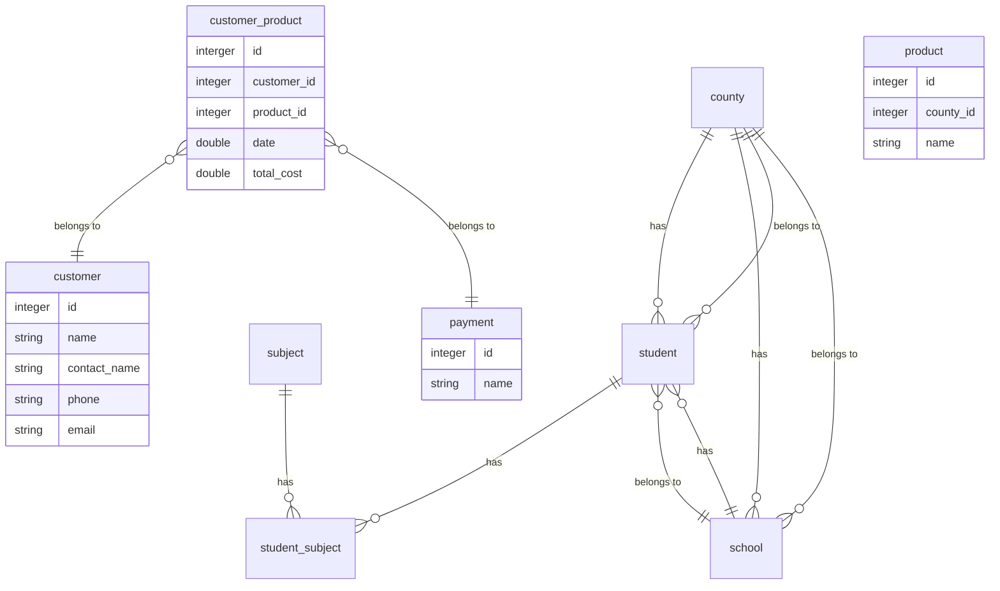

# Azani ISP Information System

## E-R Diagram

```mermaid
erDiagram
county ||--o{ student : "has"
county ||--o{ school : "has"
school ||--o{ student : "has"
student ||--o{ student_subject : "has"
subject ||--o{ student_subject : "has"
student }o--|| county : "belongs to"
student }o--|| school : "belongs to"
school }o--|| county : "belongs to"
customer_product }o--|| customer : "belongs to"
customer_product }o--|| payment : "belongs to"

product {
    integer id
    integer county_id
    string name
}

customer {
    integer id
    string name
    string contact_name
    string phone
    string email
}

payment {
    integer id
    string name
}

customer_product {
    interger id
    integer customer_id
    integer product_id
    double date
    double total_cost
}
```

